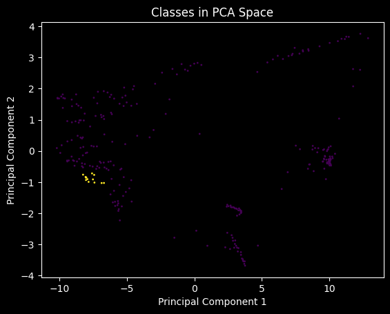

# Topics
***

    

***
## Introduction
Welcome to my README file! As a scientist, I specialize in various topics that revolve around the fascinating world of research and discovery. In this document, I will provide an overview of my areas of expertise and the subjects that I am passionate about.

## Areas of Interest and Expertise.
1. Information Theory: I would like to start by citing S.H. words, or as I would like to remember, "Keep Talking" by Pink Floyd: 

> For millions of years, mankind lived just like the animals. Then something happened which unleashed the power of our imagination. We learned to talk and we learned to listen. Speech has allowed the communication of ideas, enabling human beings to work together to build the impossible. Mankind's greatest achievements have come about by talking, and its greatest failures by not talking. It doesn't have to be like this. Our greatest hopes could become reality in the future. With the technology at our disposal, the possibilities are unbounded. All we need to do is make sure we keep talking.

2. Signal Analysis and spectroscopy tools: Experienced with creating and using the latest tools for spectroscopy. Both technical and scientific knowledge of the field is developed in the related projects.

3. Natural Language Processing: Specialized in the manipulation of natural language data.With current projects to help developers create better solutions for their and their future.

